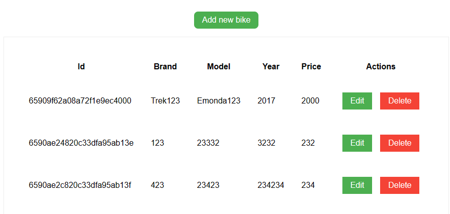
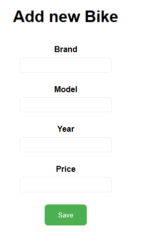
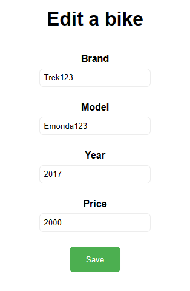

# Bikes

## Running the backend

In backend folder, copy `.env.example` to `.env` and set the database credentials.
Install all the dependencies:
```bash
npm install
```

Run the app:
```bash
node index.js
```

## Running the frontend

Just go into frontend folder and open `index.html` in your browser.

### List page


### New page



### Edit page


